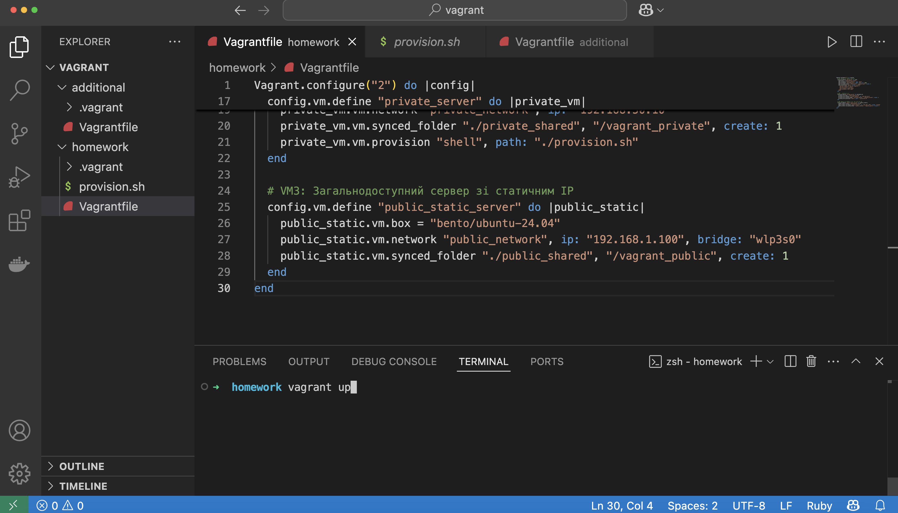
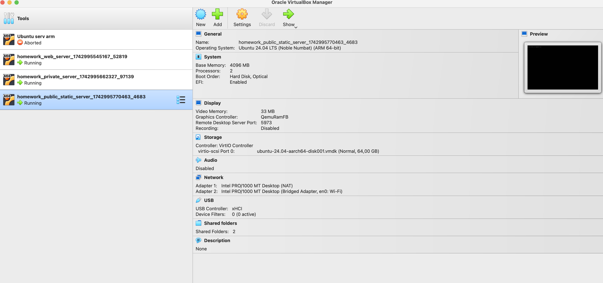
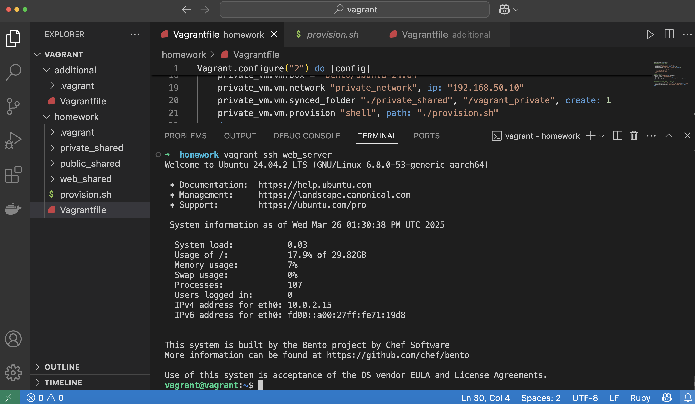
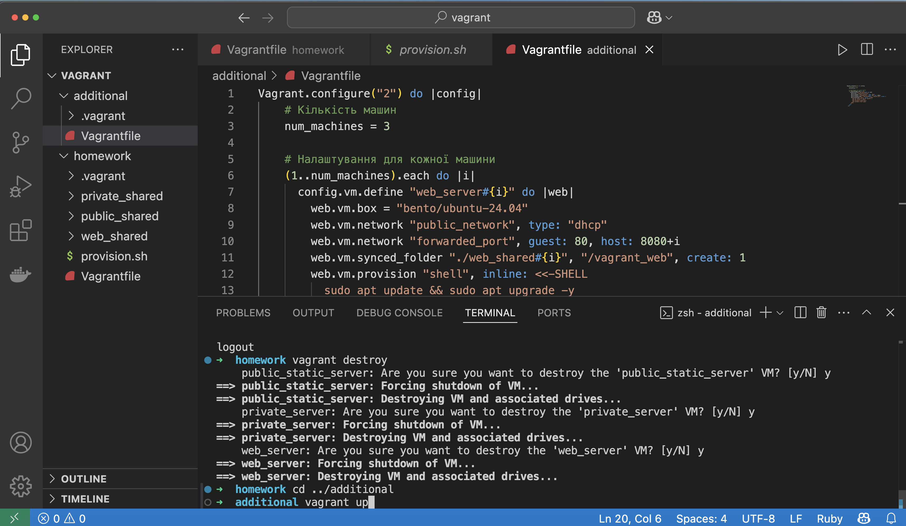
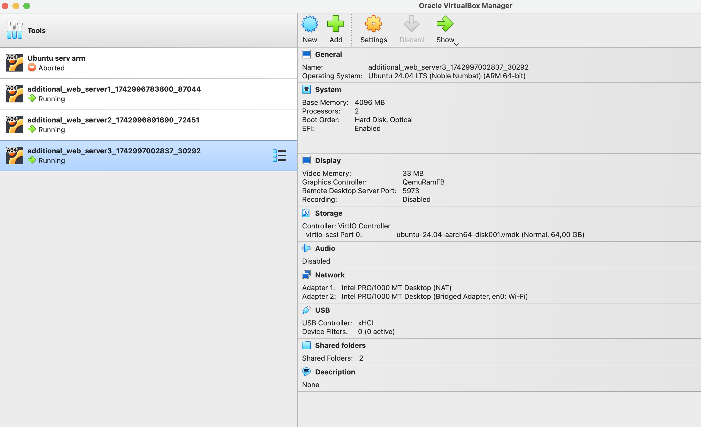
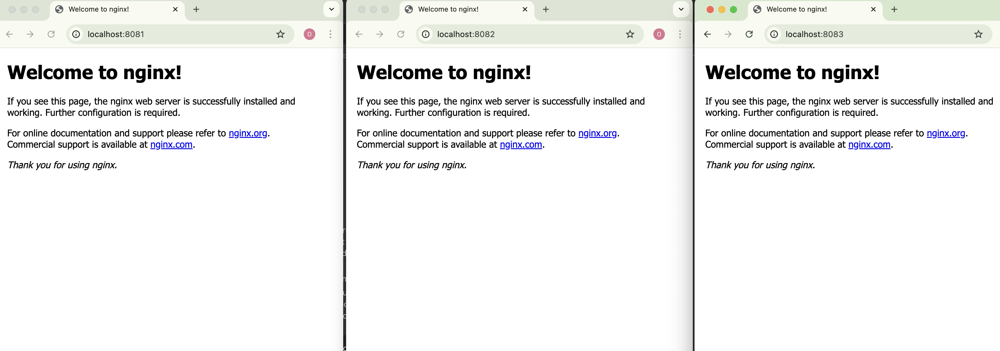

# README

## Огляд

Цей репозиторій містить конфігураційні файли `Vagrantfile` для автоматичного створення та налаштування віртуальних машин за допомогою Vagrant. Конфігурації підтримують різні сценарії: запуск окремих віртуальних машин із різними мережевими параметрами та створення кількох однакових веб-серверів.

## Вимоги

Перед використанням цього репозиторію необхідно встановити:

- [VirtualBox](https://www.virtualbox.org/)
- [Vagrant](https://www.vagrantup.com/)

## Вміст

### 1. [`Vagrantfile`](./homework/Vagrantfile) для запуску кількох віртуальних машин з різними параметрами

Цей [`Vagrantfile`](./homework/Vagrantfile) створює три віртуальні машини:

- **Web Server** – загальнодоступний вебсервер з DHCP та пробросом порту 80 на 8080.
- **Private Server** – приватний сервер у локальній мережі з IP `192.168.50.10`.
- **Public Static Server** – загальнодоступний сервер зі статичним IP `192.168.1.100`.

#### Запуск

```sh
vagrant up
```


#### Доступ

- Вебсервер буде доступний за адресою: `http://localhost:8080`
- Приватний сервер доступний лише в межах локальної мережі
- Публічний сервер доступний через статичний IP
- Доступ по ssh vagrant 


### 2. [`Vagrantfile`](./additional/Vagrantfile) для створення трьох ідентичних веб-серверів (додаткове завдання)

Ця конфігурація автоматично створює три однакові веб-сервери, кожен з яких:

- Має окремі прокидання портів (`8081`, `8082`, `8083`)
- Синхронізує окрему папку `web_sharedX`.

#### Запуск

```sh
vagrant up
```


#### Доступ
- Перший сервер: `http://localhost:8081`
- Другий сервер: `http://localhost:8082`
- Третій сервер: `http://localhost:8083`


## Корисні команди

```sh
vagrant up  # Запуск та налаштування ВМ
vagrant halt   # Зупинити всі ВМ
vagrant destroy  # Видалити всі ВМ
vagrant ssh web_server  # Підключитися до вебсервера
```


