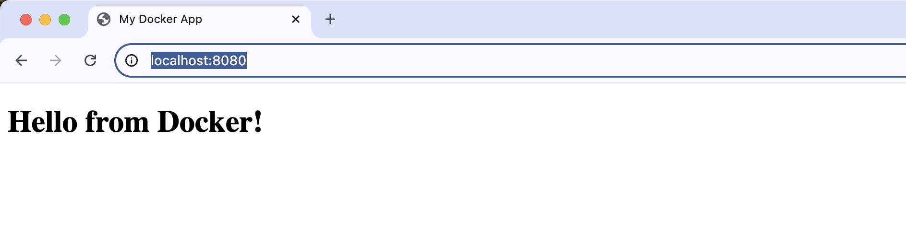
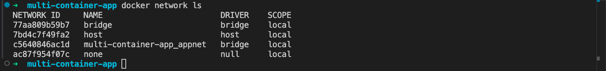
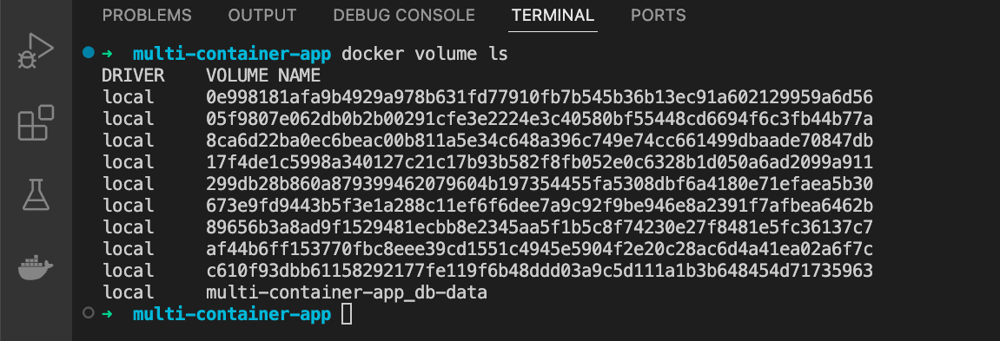
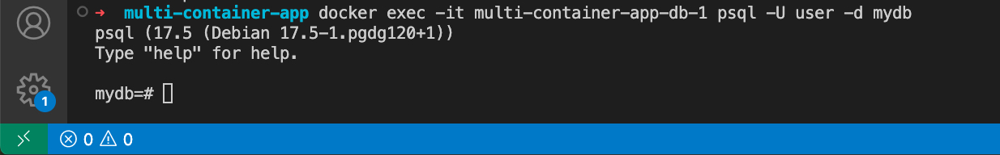

## **Створення файлу docker-compose.yml**

```shell
mkdir multi-container-app
cd multi-container-app
```

```shell
mkdir web-data
nano web-data/index.html
```

### 

```html
<!DOCTYPE html>
<html>
<head>
  <title>My Docker App</title>
</head>
<body>
  <h1>Hello from Docker!</h1>
</body>
</html>
```

### 

### **Створення docker-compose.yml файлу**

```yaml
version: '3.8'
services:
  web:
    image: nginx:latest
    ports:
      - "8080:80"
    volumes:
      - ./web-data:/usr/share/nginx/html:ro
    networks:
      - appnet
  db:
    image: postgres:latest
    environment:
      POSTGRES_USER: user
      POSTGRES_PASSWORD: password
      POSTGRES_DB: mydb
    volumes:
      - db-data:/var/lib/postgresql/data
    networks:
      - appnet
  cache:
    image: redis:latest
    networks:
      - appnet
volumes:
  db-data:
  web-data:
networks:
  appnet:
```

## **Запуск багатоконтейнерного застосунку**

### **Запуск сервісів у фоновому режимі:**

```shell
docker-compose up -d
```


### **Перевірка стану контейнерів:**

```shell
docker-compose ps
```

###  **Перевірка вебінтерфейсу:**

[**http://localhost:8080**](http://localhost:8080)

## **Мережі та томи**

### **Список створених мереж:**

```shell
docker network ls
```

### **Список створених томів:**

```shell
docker volume ls
```


### **Підключення до PostgreSQL:**

Дізнаємось  ім’я контейнера:

```shell
docker-compose ps
```


Підключіться до контейнера:

```shell
docker exec -it <db_container_name> psql -U user -d mydb
```

## **Масштабування вебсервера**

Спочатку додамо файл конфігурації для nginx так як буде помилка зайнятого порта 8080

Створиму папку **nginx** та файл **default.conf**

#### 

```yaml
upstream web_backend {
    server web:80;
}
server {
    listen 80;
    location / {
        proxy_pass http://web_backend;
    }
}
version: '3.8'
services:
  loadbalancer:
    image: nginx:latest
    ports:
      - "8080:80"
    volumes:
      - ./nginx/default.conf:/etc/nginx/conf.d/default.conf:ro
    depends_on:
      - web
    networks:
      - appnet
  web:
    image: nginx:latest
    volumes:
      - ./web-data:/usr/share/nginx/html:ro
    networks:
      - appnet
  db:
    image: postgres:latest
    environment:
      POSTGRES_USER: user
      POSTGRES_PASSWORD: password
      POSTGRES_DB: mydb
    volumes:
      - db-data:/var/lib/postgresql/data
    networks:
      - appnet
  cache:
    image: redis:latest
    networks:
      - appnet
volumes:
  db-data:
networks:
  appnet:
```

### **Запуск маштабування** 

```shell
docker-compose up -d --scale web=3
```


### **Та перевірка**
http://localhost:8080

